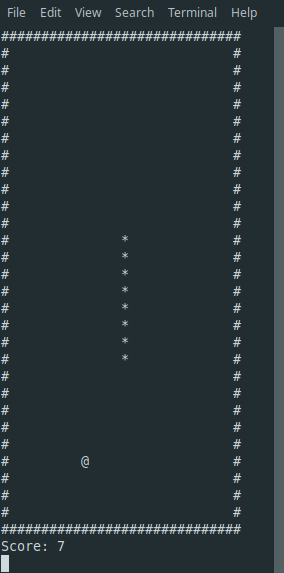

## SNAKE GAME
I was bored and decided to make a command line/terminal version of Snake. Currently only works on linux (I develped this on Linux Mint 19.1 Cinnamon).

## CONTROLS
#### Vim controls!

h: Left

j: Down

k: Up

l: Right

q: Quit

## GAME RULES
1. No going in opposite directions (i.e. if you are going left you cannot go right immediately).
2. Snake can wrap-around so feel free to hit a wall.
3. If Snake touches itself you lose!
4. Snake resets after max size but score stays.

